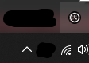
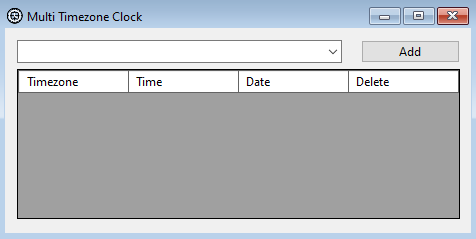
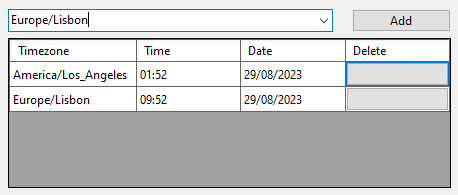
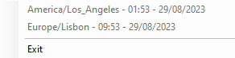

# MultiTimezoneClock
 
A multi timezone clock that allows the user to check what time it is in many countries without the need to open a browser tab.

> Q: Why did you do this? A: I don't know, I'm just lazy af.
___
The app will start minimized to tray and you can open it by double clicking.

  

To add a timezone, select one from the dropdown list and click on the "Add" button:

  
  

To delete a timezone, simply click on the button below "Delete" header.

Every time you add or delete a timezone, the app will save them inside `MultiTimezoneClock\timezones.txt` located inside the `Documents` folder of your computer.

To check the what time it is, right click the tray icon.
You can exit the app by clicking the "Exit" button.

  

